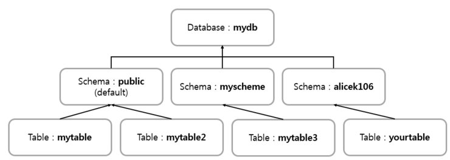

# PostgreSQL study using Azure Linux VM

## 1. How to connect VM

```
ssh -i "C:\Users\GyuheonSim\OneDrive - Standard Energy\Study\Postgres\PostgresStudy-VM_key.pem" azureuser@20.94.78.193
```

## 2. Change User (azureuser -> postgres)

```
sudo su postgres 
```

## 3. Execute database
```
psql
```

## 4. Useful Commands

```
\d, \dt, \du, \dn, \l, \d + table name :
 모든 테이블 목록, 유저, 스키마, 데이터베이스, 테이블 정보(칼럼 등...)
```

## Others...
* Create DB & User roles
    ```
    CREATE DATABASE mydbname;
    CREATE USER myusername WITH ENCRYPTED PASSWORD 'MyPassWord';
    GRANT ALL PRIVILEGES ON DATABASE mydbname TO myusername;
    ```

* Postgres의 구조
    

* 정리된 사이트

https://velog.io/@gwak2837/%EB%8D%B0%EC%9D%B4%ED%84%B0%EB%B2%A0%EC%9D%B4%EC%8A%A4-%EC%8B%9C%EC%8A%A4%ED%85%9C-%EC%8B%A4%EC%8A%B52


